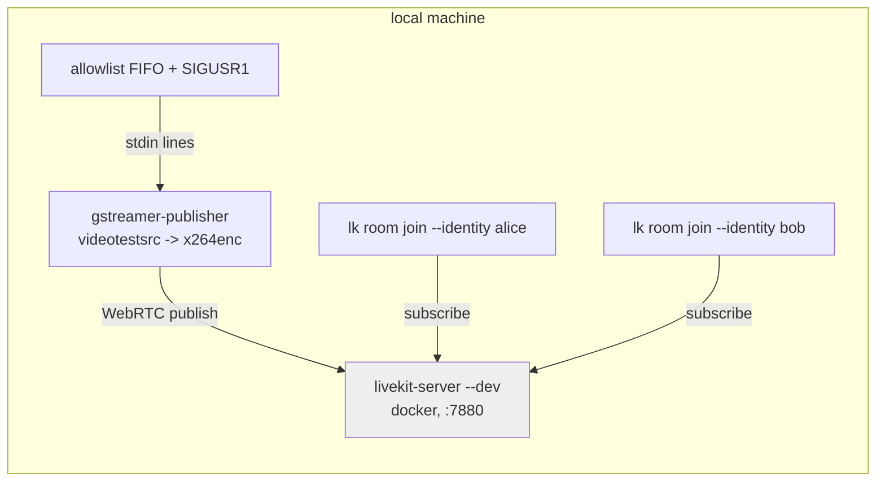

# Local testing guide — publisher allowlist & subscription permissions

How to test the `gstreamer-publisher` locally against a real LiveKit server, with
special focus on the subscription-allowlist features introduced by changes
`2026-09-09--sandbox-stream-subscription-allowlist` (flag) and
`2026-09-09--sandbox-stream-allowlist-dynamic-updates` (stdin + SIGUSR1).

Companion scripts live in `04_validation/scripts/`. See also `test-runbook.md`
for build/lint validation.

## Why not a mock?

The LiveKit wire protocol (signal + WebRTC) is not practical to fake, and the
enforcement we want to verify — who may subscribe to published tracks — happens
**in the LiveKit server**, not in the publisher. The publisher only sends a
`SetSubscriptionPermission` request (`publish.go: applyAllowlist`). So the
correct local test setup is a real `livekit-server` in dev mode plus
subscriber participants that observe enforcement. No cloud account needed.

## Prerequisites

| Tool | Purpose | Notes |
|---|---|---|
| Docker | run `livekit/livekit-server --dev` | dev mode accepts tokens signed with `devkey`/`secret` |
| `lk` (LiveKit CLI) | create tokens, join room as test subscriber | install: `curl -sSL https://get.livekit.io/cli \| bash` |
| Go + GStreamer dev libs | build the publisher | `direnv allow` then `go build ./...` → produces `./gstreamer-publisher` |
| gst-plugins-good | `videotestsrc`, `vp8enc` for the default test pipeline | in `/mnt/work/nix-shells/golang` flake; `x264enc` would additionally need `gst-plugins-ugly` |

## Test setup architecture



- The publisher applies the allowlist **only on `SIGUSR1`** after a stdin line
  updates it (or once at startup from `--allowed-users` / `LIVEKIT_ALLOWED_USERS`).
- A FIFO is used for stdin so the pipe never EOFs — note the publisher's stdin
  reader **stops on first EOF**, so `echo "alice" | publisher` only works if the
  line is sent before EOF and followed by SIGUSR1; the FIFO held open (`<>`) is
  the reliable interactive approach.

## Quickstart (scripts)

```bash
# 0. build
go build ./...

# 1. start LiveKit dev server (terminal 1, keeps running)
icm/04_validation/scripts/start-server.sh

# 2. generate tokens into scripts/tokens.env (devkey/secret)
icm/04_validation/scripts/mk-tokens.sh test

# 3. start the publisher with an interactive allowlist FIFO (terminal 2)
icm/04_validation/scripts/run-publisher.sh        # optional args: "<pipeline>" "<initial users>"

# 4. change the allowlist while it runs
icm/04_validation/scripts/update-allowlist.sh alice
icm/04_validation/scripts/update-allowlist.sh alice bob
icm/04_validation/scripts/update-allowlist.sh bob          # revoke alice

# 5. join as subscribers (terminal 3+); watch tracks appear/disappear
icm/04_validation/scripts/join-subscriber.sh alice
icm/04_validation/scripts/join-subscriber.sh bob
```

## What to look for

### Publisher side

- `subscription permission applied allowedIdentities=N` (via `logger.Infow` in
  `applyAllowlist`) after startup and after each `SIGUSR1`.
- `found source mimeType=video/x-h264` at pipeline discovery.
- No `SetSubscriptionPermission` call at all when the allowlist is empty
  (see "Known gaps" below).

### Subscriber side (`lk room join`)

`lk room join` subscribes automatically and logs track events:

| Scenario | Expected subscriber behaviour |
|---|---|
| identity **in** current allowlist | track subscribed; video flows |
| identity **not** in allowlist | no track subscription (permission denied by server) |
| removed from allowlist by update | existing subscription torn down after `SIGUSR1` |
| re-added via update | track becomes subscribable again |

A test subscriber has a **subscribe-only token** (`canPublish=false`) so the
test cannot be polluted by the subscriber publishing its own tracks.

### Suggested test matrix

1. Startup with `--allowed-users alice` → alice gets tracks, bob doesn't.
2. Startup with no allowlist → **both** get tracks (server default, publisher
   never calls `SetSubscriptionPermission` — pins down current semantics).
3. Stdin line + `SIGUSR1` adds a user → new subscriber starts receiving.
4. Stdin line + `SIGUSR1` removes a user → their subscription stops.
5. Malformed / whitespace-only / empty stdin lines → ignored (`parseAllowedUsers`
   returns nil → skipped; no SIGUSR1 needed).
6. SIGINT/SIGTERM → clean shutdown (pipeline to NULL, room disconnect).

## Known gaps found while writing this guide

1. **The allowlist can never be cleared to empty.** `applyAllowlist` returns
   early when `len(users) == 0`, so an empty line + SIGUSR1 keeps the previous
   permissions. If "revoke everyone" (e.g. sandbox session end) is a use case,
   this is a bug → dev-agent follow-up.
2. **Empty initial allowlist = server default (everyone may subscribe).**
   Intentional-looking, but should be pinned by the test matrix above.
3. **stdin reader stops at first EOF** — callers that pipe instead of using a
   held-open FIFO lose dynamic updates silently.

## Manual run (no scripts)

```bash
docker run --rm -p 7880:7880 livekit/livekit-server --dev

lk token create --api-key devkey --api-secret secret \
  --identity publisher --room test --join --valid-for 24h
lk token create --api-key devkey --api-secret secret \
  --identity alice --room test --join --valid-for 24h \
  --grant '{"canPublish": false, "canPublishData": false}'

mkfifo /tmp/allowlist
exec 3<>/tmp/allowlist            # open read-write: never blocks, never EOFs

./gstreamer-publisher --url ws://localhost:7880 --token $PUB_TOKEN \
  --allowed-users alice -- \
  videotestsrc is-live=true ! video/x-raw,width=640,height=480 ! \
  videoconvert ! clockoverlay ! vp8enc deadline=1 keyframe-max-dist=60 target-bitrate=1000000 \
  < /tmp/allowlist &

echo "alice bob" > /tmp/allowlist && kill -USR1 <publisher-pid>
lk room join --url ws://localhost:7880 --api-key devkey --api-secret secret \
  --identity bob test
```

## Troubleshooting (Nix environment)

Symptoms: `undefined symbol: gst_state_get_name` warnings from `gst-plugin-scanner`
followed by `no element "videotestsrc"`, then exit.

1. **ABI skew** — binary linked against an older GStreamer than the shell's
   plugin path. Fix: `direnv reload` and **rebuild** (`go build ./...`) so the
   RUNPATH matches `GST_PLUGIN_SYSTEM_PATH_1_0`.
   Check: `readelf -d gstreamer-publisher | grep -oE 'gstreamer-[0-9.]+'` must
   match the version in `echo $GST_PLUGIN_SYSTEM_PATH_1_0`.
2. **Poisoned registry cache** — after a mixed-version run,
   `~/.cache/gstreamer-1.0/registry.x86_64.bin` caches base plugins as failed
   even in a fixed env. Fix: `rm -rf ~/.cache/gstreamer-1.0`.
3. **Missing plugins** — flake only ships base + good. `videotestsrc`/`vp8enc`
   are in `good`; `x264enc` needs `ugly` (add to flake if H264 testing is
   required).
4. **LiveKit server binds loopback inside the container** — plain
   `docker run -p 7880:7880 livekit/livekit-server --dev` gives
   `connection reset by peer` from the host. `start-server.sh` uses
   `--network host` (Linux) to avoid it.
5. **`lk room join` defaults to `AutoSubscribe: false`** and takes no `--token`
   flag — `join-subscriber.sh` passes `--api-key/--api-secret/--identity
   --auto-subscribe` explicitly. Without `--auto-subscribe` subscribers join but
   never attempt subscription, silently masking permission behavior.
6. **`vp8enc` property is `target-bitrate`**, not `bitrate` (that's x264enc).

## Verified evidence (2026-09-09)

Run against `livekit-server --dev` (docker, host networking):

```
publish.go:275  found source                    {"mimeType": "video/x-vp8"}
publish.go:189  subscription permission applied {"allowedIdentities": 1}
lk alice:       track subscribed {"kind": "video", "participant": "publisher"}   # while allowlisted
# update-allowlist.sh bob  ->  subscription permission applied (SIGUSR1)
lk alice:       (no track subscription)                                          # after revoke
lk bob:         track subscribed {"kind": "video", "participant": "publisher"}   # after add
```

## Recording evidence

When this testing is used to validate a change, record output snippets
(publisher log lines + subscriber track events) in the change folder under
`icm/03_changes/<change>/04_validation/`, per `icm/AGENTS.md` dev-agent rules.
